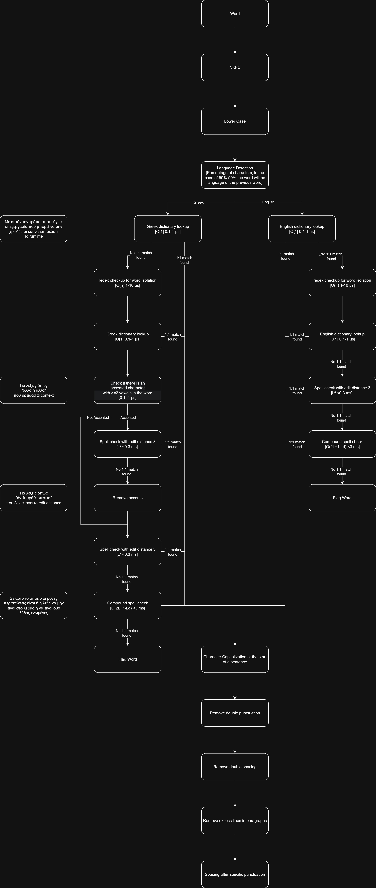

# Billingual Spell Checker

Comprehensive bilingual SymSpell correction pipeline capable of detecting and correcting Greek and English words with accent normalization, edit-distance tuning and language-aware token handling. 

## `symspell.py`

## Dictionaries

### 1. `GreekDictionary.txt`

Largest Greek dictionary for SymSpell, consisting of over 1.3 million unique words from multiple linguistic sources.  
**Note:** Currently, there are no frequency counts associated with the words.

**Sources:**

- [Orthos](https://sourceforge.net/projects/orthos-spell/)
- [Hunspell](https://sourceforge.net/projects/grspell/files/hunspell-gr/) (With all possible Greek word forms were generated from the root entries)
- [kaikki](https://kaikki.org/dictionary/Greek/)
- [Wiktionary](https://el.wiktionary.org/wiki/%CE%9A%CE%B1%CF%84%CE%B7%CE%B3%CE%BF%CF%81%CE%AF%CE%B1:%CE%9D%CE%AD%CE%B1_%CE%B5%CE%BB%CE%BB%CE%B7%CE%BD%CE%B9%CE%BA%CE%AC)

### 2. `EnglishDictionary.txt`

Just the [symspell](https://github.com/wolfgarbe/SymSpell/tree/master/SymSpell.FrequencyDictionary) official dictionary.
